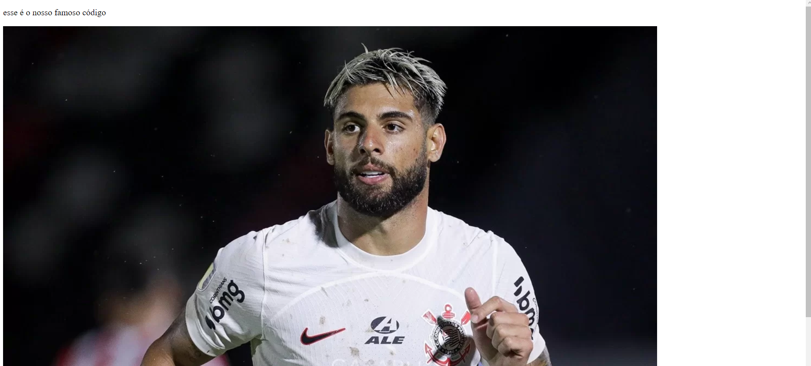
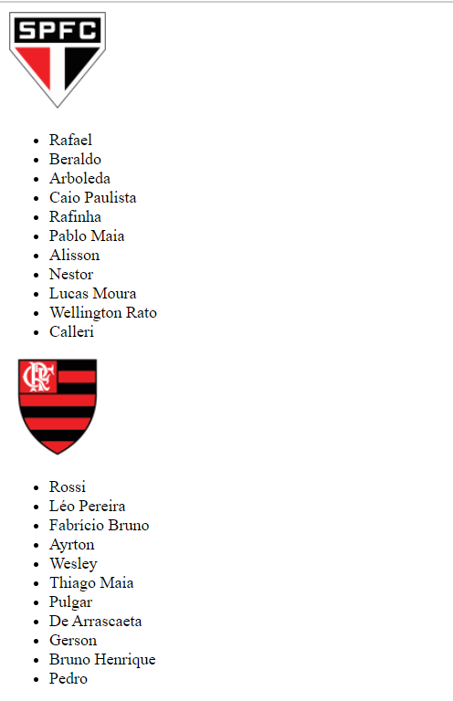

### Descrição

Adicione aqui a descrição do seu Pull Resquest.

### Revisar

- [ ] O código deverá apresentar duas imagens
- [ ] O código deverá apresentar uma lista abaixo das imagens
- [ ] O idioma do site deve estar configurado em pt-br

### Pre-Merge Checklist

- [ ] Verificar se existe algum erro de escrita
- [ ] Verificar Boas práticas

### Screenshots

| Before | After  |
| ------ | ------ |
||   |